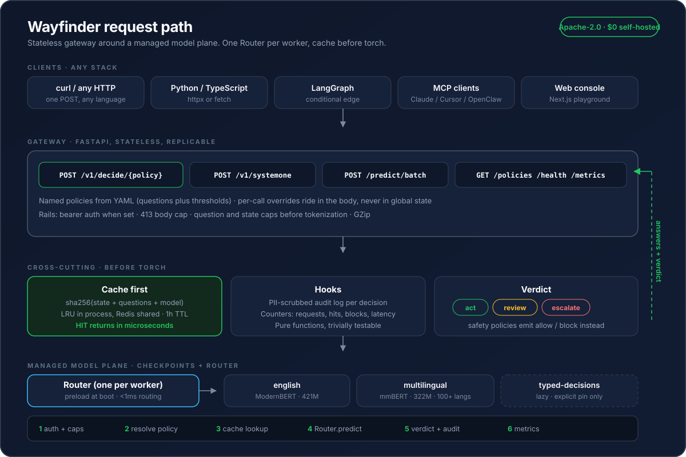

# Wayfinder: doubt, as a service

One HTTP call turns any text, in 100+ languages, into a calibrated
**act / review / escalate / block** verdict. About 33ms per decision,
$0 self-hosted, no hallucination, nothing to parse.

Built on [`laya`](https://huggingface.co/convaiinnovations/laya) via
`pip install laya[serve]`. This repo contains zero model code. It is the
stateless gateway, policies, UI, and MCP server around it.



## What this adds on top of laya

laya gives you a `Router`, typed `choice` / `score` / `noul` answers, and
checkpoints. Wayfinder turns that into infrastructure any stack can call:

| laya (pip package) | Wayfinder (this repo) |
|---|---|
| `Router.predict` in Python | `POST /v1/decide/{policy}` over HTTP, Jev-compatible `POST /v1/systemone` |
| Raw answers | Plus a **verdict** from per-policy thresholds |
| Your own caching | sha256 LRU in process, Redis shared across replicas, 1h TTL |
| Your own logging | PII-scrubbed audit line per decision, `/metrics` counters |
| Your own YAML | `wayfinder/policies.yaml`: 4 reviewed bundles with thresholds |
| Your own clients | Next.js console, MCP stdio server, curl/Python/TS snippets |

## 30-second start (gateway + UI)

```bash
python3 -m venv .venv && .venv/bin/python -m pip install -e .
WAYFINDER_PRELOAD=0 .venv/bin/python -m wayfinder.app   # API on :8000, instant boot
cd web && npm install && npm run dev          # UI on :3000
```

```bash
curl -s localhost:8000/v1/decide/support_inbound -H 'content-type: application/json' -d '{
  "state": {"body": "Billed twice, refund today or we cancel"}
}' | python -m json.tool
# verdict: act, answers for department/urgency/churn/refund, routing metadata
```

First inference downloads the checkpoint from Hugging Face (cached after).
Set `WAYFINDER_PRELOAD=1` in production so language flips cost under 1ms.

## Endpoints

| Method | Path | Use |
|---|---|---|
| POST | `/v1/decide/{policy}` | Named policy (YAML questions + thresholds) plus verdict |
| POST | `/v1/systemone` | Jev-compatible: existing Jev clients repoint `baseUrl` here unchanged |
| POST | `/predict` | Raw `{state, questions}` with auto-routing |
| POST | `/predict/batch` | 1-128 states, shared forward passes (about 1ms/q batched on GPU) |
| GET | `/policies` `?full=1` | Catalogue, or full schemas for builders |
| GET | `/health` `/metrics` | Readiness probe, hit-rate/latency/block counters |
| GET | `/docs` | OpenAPI playground |

Policies ship in `wayfinder/policies.yaml`: `llm_firewall`, `support_inbound`,
`model_router`, `content_safety`. Thresholds are per-call overridable via
`{"options": {"auto_act_above": 0.9}}`. Full reference: [`docs/API.md`](docs/API.md).

## Any-stack integration

```bash
# any language with HTTP
curl localhost:8000/v1/decide/llm_firewall -d '{"state":{"prompt":"..."}}'
```

```python
# Python
import httpx
r = httpx.post("http://localhost:8000/v1/decide/support_inbound",
               json={"state": {"body": text}}, timeout=60).json()
if r["verdict"]["verdict"] == "act":
    route_automatically(r)
else:
    escalate_to_human(r)
```

```ts
// TypeScript
const r = await fetch("http://localhost:8000/v1/decide/model_router", {
  method: "POST", headers: { "content-type": "application/json" },
  body: JSON.stringify({ state: { request } }),
}).then((r) => r.json());
```

MCP clients (Claude Desktop, Cursor): `pip install -e ".[mcp]"`, then
`wayfinder-mcp` over stdio with `wayfinder_decide`, `wayfinder_predict`, `wayfinder_route`,
`wayfinder_policies`, `wayfinder_status`. See [`docs/MCP.md`](docs/MCP.md).

## Platform: auth, keys, metrics, logs, admin

Beyond stateless inference, the gateway ships a full platform layer:

- **Managed auth** via self-hosted [SuperTokens](https://supertokens.com)
  (email/password + optional Google/GitHub OAuth — zero passwords in this repo);
  keyless `dev-admin` mode when unconfigured.
- **Service tokens**: per-user `wf_…` API keys, hashed at rest, shown once,
  revocable from `/dashboard` or `DELETE /v1/keys/{prefix}`.
- **Per-user metrics & logs**: `/dashboard` shows requests, hit rate, p95,
  quota, and a filterable PII-scrubbed request log (`GET /v1/me/usage`, `/v1/me/logs`).
- **Rate limiting + quotas**: per-key/user and per-IP windows tiered by plan
  (free 60/min · pro 600/min · enterprise unlimited), monthly quotas, `429` + `Retry-After`.
- **Super-admin console** at `/admin`: global overview, users (roles, plans,
  quotas, disable), all keys, platform-wide logs, system health
  (`GET /v1/admin/*` for scripts).

Quick start: create a key and call the API with it —

```bash
curl -X POST localhost:8000/v1/keys -H "Cookie: ..." \
  -H 'content-type: application/json' -d '{"name":"prod"}'
# -> {"key":"wf_...","prefix":"wf_..."}  (raw shown ONCE; sign in at /auth first,
#    or pass Authorization: Bearer <wf-key> when you already have one)
curl localhost:8000/v1/decide/support_inbound -H "Authorization: Bearer wf_..." \
  -H 'content-type: application/json' -d '{"state":{"body":"refund pls"}}'
```

Full runbook (SuperTokens setup, Railway deploy, platform API, limits): [`docs/PLATFORM.md`](docs/PLATFORM.md).

## Production

```bash
docker compose up --build          # gate + redis, models cached in a volume
```

Env contract: `LAYA_DEVICE` `WAYFINDER_PRELOAD` `LAYA_MODELS` `LAYA_THREADS`
(at or below physical cores) `WAYFINDER_API_KEY` (bearer when set)
`WAYFINDER_REDIS_URL` (shared cache past 1 replica). Details: [`docs/DEPLOY.md`](docs/DEPLOY.md).

## Calibration honesty

Laya probabilities come from proper scoring rules with temperature fitting
(base ECE 0.466 down to 0.081 on English), but multilingual ships
uncalibrated. Fit temperatures on your own held-out data before trusting
`auto_act_above` in production. Start at 0.85/0.60, measure escalation
precision for a week, then tune per policy. Gate on `confidence`, never on
`action.act_probability` (it reads near 1.0 for almost every input upstream).

## Docs and contributing

Docs live in [`docs/`](docs/): [architecture](docs/ARCHITECTURE.md),
[API](docs/API.md), [policies](docs/POLICIES.md), [MCP](docs/MCP.md),
[deploy](docs/DEPLOY.md). To contribute, read
[CONTRIBUTING.md](CONTRIBUTING.md). License: Apache-2.0 ([LICENSE](LICENSE)).
