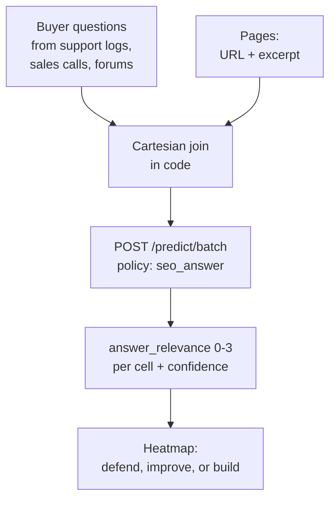

AI search doesn't rank one page for one keyword. It lifts answers across related questions — and nobody can tell you, offhand, which of your pages actually answers which of your buyers' questions. The page-vs-question grid is the artifact that answers it, and it has always been too expensive to build: thousands of cells, each one a careful relevance judgement.

Until the judgement costs a fraction of a cent. Score one page against one question, repeat across the grid, and read the coverage like a heatmap. Strong cells are your citation surface. Empty rows are questions you have no page for — and right now, someone else's page is getting cited instead.

## The architecture



The join is the expensive-looking part and it is just code. A hundred questions times fifty pages is five thousand cells — forty batch calls, cents of metered spend, minutes of wall clock.

## Build it

```bash
curl $WF_URL/predict/batch \
  -H "authorization: Bearer $WF_KEY" -H 'content-type: application/json' -d '{
  "states": [{"buyer_question": "How do I find orphan pages?",
              "page_url": "/orphans",
              "page_excerpt": "Run a crawl, filter zero-inlink pages..."}],
  "policy": "seo_answer"
}'
```

```python
rows = run("answer", cells)  # examples/seo_bulk.py
gaps = [r for r in rows if r["answer_relevance"] < 1.0]
```

Read the grid in three passes: defend the 3s (they earn citations today), improve the 1s and 2s (one section away from best-in-class), and build for the empty rows. That third list, sorted by question frequency, is the only content roadmap you need this quarter.

## Where questions come from

The grid is only as good as its rows. Mine support tickets, sales call transcripts, community forums, and "people also ask" boxes — real buyer language, not keyword-tool paraphrases. Twenty real questions beat two hundred synthetic ones.

## Pitfalls

- **Excerpts, not whole pages.** The first screen of content is what gets cited; score that.
- **Confidence cuts both ways.** A 2.5 with low confidence is a "probably answered" — spot-check before you celebrate.
- **Rebuild quarterly.** AI answer engines shift what "answered" means. The grid is a living artifact, not a report.
