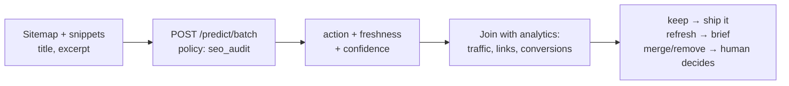

Content audits die in spreadsheets. Somebody exports 900 URLs, adds columns for traffic and backlinks, and then the actual judgement — keep, refresh, merge, remove — has to be made 900 times by a human who gives up at row 60. The spreadsheet becomes a monument to good intentions.

The judgement is a choice question. The traffic data is a spreadsheet. Stop mixing them: let the model triage content quality, join its verdicts with your analytics in code, and spend human hours only on the merges and removals, which are the only calls with real downside.

## The architecture



The model never sees your traffic numbers, and that is deliberate. A page with zero traffic and a "keep" verdict is a distribution problem, not a content problem. A page with great traffic and a "remove" verdict is a redirect plan waiting to happen. The interesting rows are the disagreements.

## Build it

```bash
curl $WF_URL/predict/batch \
  -H "authorization: Bearer $WF_KEY" -H 'content-type: application/json' -d '{
  "states": [{"url": "/old-guide", "title": "2019 SEO guide",
              "snippet": "Keyword density tips from 2019.", "traffic_band": "low"}],
  "policy": "seo_audit"
}'
```

```python
rows = run("audit", pages)  # examples/seo_bulk.py
for r in rows:
    sheet.write(r["id"], action=r["action"], freshness=r["freshness"])
```

Forty pages flagged refresh become forty briefs. Nine hundred "keep" verdicts become the meeting you don't have to hold.

## The freshness trick

The freshness score is doing quiet work beside the action pick. A page can be structurally right ("keep") but stale — the score tells your writer *how much* updating it needs. Sort refresh rows by freshness ascending and you have the editorial calendar ordered by embarrassment.

## Pitfalls

- **Merge and remove always get a human.** Deleting indexed URLs is the one irreversible action in this workflow. The model proposes; an editor disposes.
- **Feed it excerpts, not vibes.** Title plus first 500 characters beats URL-only states by a mile.
- **Mind cannibalization separately.** Two "keep" pages on the same query are a merge the audit won't flag — pair this with your intent map.
