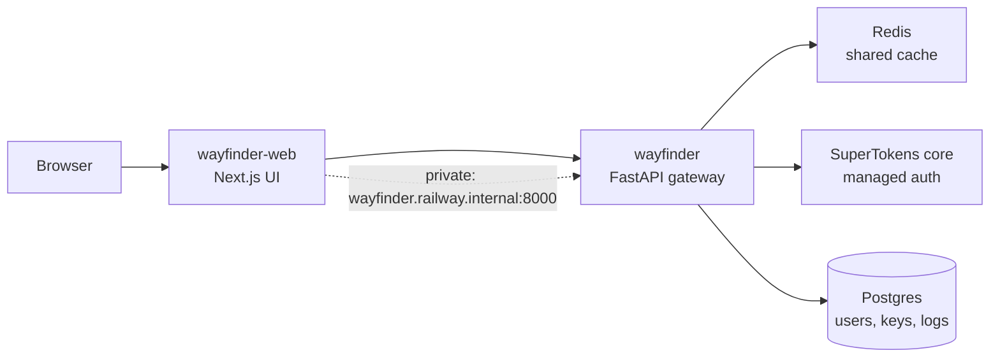

Wayfinder runs as two services: a FastAPI gateway (API only) and a Next.js frontend (the only UI). In production they live on Railway behind two domains, talking to each other over private networking. This guide sets up that exact layout. Total moving parts: fewer than you fear.

## The architecture



The rule that matters: the frontend reaches the gateway over the Railway private network, never the public URL. Public hops add latency and trip bot protection; the private address is fast and boring, which is what you want from infrastructure.

## Service 1: the gateway

Deploy from the repo root with the `Dockerfile` builder and a `/health` healthcheck. Pin `PORT=8000` on the service — Railway reassigns `PORT` on every redeploy, and an unpinned gateway drifts ports and silently breaks the frontend's private URL. (A `${{wayfinder.PORT}}` reference resolves empty. Don't use it.)

Production env that matters:

| Variable | Value |
|---|---|
| `WAYFINDER_DOCS` | `0` — hides Swagger and openapi.json |
| `WAYFINDER_REQUIRE_AUTH` | `1` — no anonymous inference |
| `WAYFINDER_PRELOAD` | `1` — checkpoints warm at boot |
| `WAYFINDER_API_URL` | `http://wayfinder.railway.internal:8000` |
| `SUPERTOKENS_*` | Core URI, API key, both domains |

Deploys go out via the CLI — auto-deploy from GitHub stays off so nothing ships by accident:

```bash
railway up
```

## Service 2: the frontend

Deploy from `web/` with Root Directory set to `web` and Dockerfile Path `Dockerfile`. If the frontend domain ever serves the gateway's JSON map, the root directory drifted and it built the Python image — that symptom is diagnostic.

```bash
cd web
railway up
```

Frontend env: `WAYFINDER_API_URL` pointing at the private gateway address, plus `NEXT_PUBLIC_SITE_URL` and `NEXT_PUBLIC_WEBSITE_DOMAIN` set to the public web hostname.

## Domains and TLS

Both hostnames are proxied CNAMEs to their Railway targets. One gotcha that has bitten real setups: the wildcard cert covers a single level only. Keep hostnames flat — nested subdomains like `backend.wayfinder.example.com` get no edge cert and fail TLS. To move a domain between services, remove it from the old one first (dashboard; the CLI can't), then attach and repoint the CNAME.

## Pitfalls

- **Never point the frontend at the public backend URL.** Private networking or nothing.
- **Set the superadmin list before first login.** `WAYFINDER_SUPERADMINS` is how the first admin exists.
- **Watch `/metrics` after every deploy.** Hit rate cratering means keys or cookies broke, not the model.
