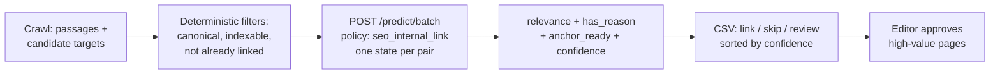

Internal linking is the most procrastinated task in SEO. Everyone knows orphan pages bleed authority, and nobody wants to read 1,200 pages to fix it. So teams either pay a frontier model to read the site one page at a time — slow, expensive, prose you can't act on — or they never do it at all.

Here is the reframe that makes it cheap: linking is not writing. For every passage, the question is "does page X have an honest reason to link to page Y, and is the anchor already sitting in the copy?" That is a yes/no judgement over a pair of texts. Ask it 8,790 times in batches and you have a link map by lunch.

## The architecture



Notice what the model never touches: crawling, status codes, canonicals, existing-link detection. Those are facts, and facts belong in code. The model gets only eligible pairs and answers one thing — does this link deserve to exist?

## Build it

One state per source-candidate pair, batched 128 at a time:

```bash
curl $WF_URL/predict/batch \
  -H "authorization: Bearer $WF_KEY" -H 'content-type: application/json' -d '{
  "states": [{
    "source_url": "/technical-seo-checklist",
    "passage": "A crawl reveals useful pages with few contextual links.",
    "candidate_title": "How to find orphan pages",
    "candidate_purpose": "Diagnose underlinked pages and reconnect them"
  }],
  "policy": "seo_internal_link"
}'
```

```python
rows = run("internal_link", pairs)  # examples/seo_bulk.py
links = [r for r in rows if r["decision"] == "link"]
```

Or run the ready-made script: `python examples/seo_bulk.py internal_link --out links.csv`.

## Reading the verdicts

Each pair returns a relevance score (0–3), two yes/no probabilities, and a confidence. The decision rule is deliberately conservative:

| Signal | Meaning |
|---|---|
| Relevance ≥ 1.5 and honest reason ≥ 0.6 | Link it |
| Confidence < 0.6 | Editor reviews |
| High-value commercial target | Editor approves regardless |
| Nothing fits | Skip — forced links rot trust |

Expect a chunk of honest "no link" verdicts. A page the model refuses to link is a finding, not a failure: it tells you where the content has no natural next step.

## What it costs

A 586-page site rebuilds its link map in under a minute for about twenty cents at metered rates — roughly 190x cheaper per page than a single-pass frontier run that got through 21 pages on the same clock. Self-hosted, it is just compute.

## Pitfalls

- **Never ask for URLs.** The model picks among candidate IDs you already know. Invented slugs are how you ship 404s.
- **Bound the candidate set.** Three to ten eligible targets per passage. Beyond that you are paying for noise.
- **Keep a holdout sample.** Have an editor label fifty pairs first, then check agreement before you auto-queue anything.
