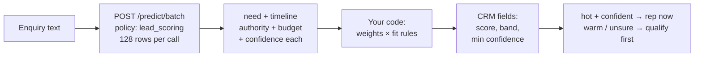

Every sales team I have watched does lead scoring the same way: a rep opens an enquiry, squints at it, and assigns a gut number from 1 to 5. It works until you get 700 enquiries in a week. Then the gut becomes a bottleneck, the follow-up SLA dies, and good leads go cold while reps argue about what a "3" even means.

The fix is not a smarter gut. It is splitting one vague judgement into four narrow ones a decision model can answer in parallel — then letting plain code do the arithmetic.

## Why one score never works

"How qualified is this lead, 1 to 5?" hides four different questions inside one number. Is it even a sales enquiry, or support wearing a sales costume? How specific is the need? What timeline did they state? Who is writing — the budget owner or an intern doing research? A "3" could mean hot need with no timeline, or a student with a deadline. You cannot act on that, and neither can your router.

So ask them separately. The `lead_scoring` policy does exactly that: one yes/no, one ordered score, three picks.

## The architecture



The model judges text. Your code owns the weights, the firmographic fit lookup, and the banding. That division matters: when your best rep disagrees with a score, you change a weight and re-run last month — no retraining, no prompt archaeology.

## Build it

One batch call scores up to 128 leads. Six calls clear 700:

```bash
curl $WF_URL/predict/batch \
  -H "authorization: Bearer $WF_KEY" -H 'content-type: application/json' -d '{
  "states": [{"body": "Need SSO for 200 seats by month end, I own budget."}],
  "policy": "lead_scoring"
}'
```

```python
rows = batch_score(states)  # examples/lead_scoring.py
for r in rows:
    crm.write(r["id"], score=r["score"], band=r["band"],
              confidence=r["min_confidence"])
```

Each row comes back with answers, a verdict, and a confidence — ready for CSV or a direct CRM write.

## Weighting without the arguments

Normalize every answer to 0–1, then weight. Ours ships as need 0.4, timeline 0.3, authority 0.2, budget 0.1 — but those numbers are yours. Start from what your last twenty won deals had in common, band at 0.65 hot / 0.35 cold, and revisit monthly. Put the bands in a sheet, not in code, so sales ops can move them without a deploy.

## The confidence rule that saves deals

This is the part teams get wrong: they treat a low score as a cold lead. A low *confidence* is not a cold lead — it is an unknown. Below 0.5 on any criterion, record "not stated" and let the first reply ask the qualifying question. Low confidence never makes a lead cold; it makes it warm. The most expensive mistake in the funnel is a good deal marked cold and ignored.

| Situation | Action |
|---|---|
| Hot score, high confidence | Rep calls today |
| Hot score, low confidence | Qualify first, then call |
| Not a sales enquiry | Route to support, don't score |

## What it costs

About 500 tokens a lead. At hosted-metered rates that is roughly two cents per *thousand* leads; self-hosted it is electricity. Either way the model line rounds to zero — what you are buying is the ten minutes of rep time you stop spending on every tyre-kicker.

## Pitfalls

- **Don't ask the model for firmographics.** Company size and industry are lookups, not judgements. Enrich first, gate with rules.
- **Don't let it do date math.** "Next Tuesday" versus your quarter boundary belongs in code.
- **Calibrate before you trust it.** Start thresholds at 0.80 act / 0.50 escalate, measure meeting-booked rate per band for a month, then tune.
