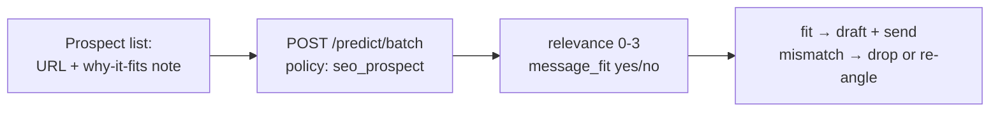

Link outreach fails silently. You send 700 personalized emails, get a 2% reply rate, and conclude outreach doesn't work — when the real problem is that half your prospects were never a fit. Nobody replies "your angle is irrelevant to my beat" — they just delete.

Fit is two judgements: is this site topically relevant, and does my angle honestly belong in what they cover? Ask both per prospect, in one batched pass, before any draft gets written. Mismatches get flagged while they are still cheap rows in a CSV.

## The architecture



The "why it fits" note in the state is doing the heavy lifting. It forces whoever built the list to articulate the angle in one sentence. If you can't write that sentence, the model can't score it — and no editor would have bought it either.

## Build it

```bash
curl $WF_URL/predict/batch \
  -H "authorization: Bearer $WF_KEY" -H 'content-type: application/json' -d '{
  "states": [{"prospect_url": "https://example.com/seo-blog",
              "why_fit": "Covers technical audits weekly"}],
  "policy": "seo_prospect"
}'
```

```python
rows = run("prospect", prospects)  # examples/seo_bulk.py
sendable = [r for r in rows if r["message_fit"] >= 0.6]
```

Seven hundred prospects plus draft-fit checks run in under a minute for under ten cents. The reply rate goes up not because the emails got better but because the list got honest.

## Pitfalls

- **Relevance without fit is a trap.** A topically perfect site that never publishes your format (no listicles, no tools roundups) is still a no.
- **Re-angle, don't force.** A mismatch with high relevance deserves a new angle, not a deleted row.
- **Log the verdicts.** Six months later, "we pitched them and they passed" reads very differently with the original fit scores attached.
