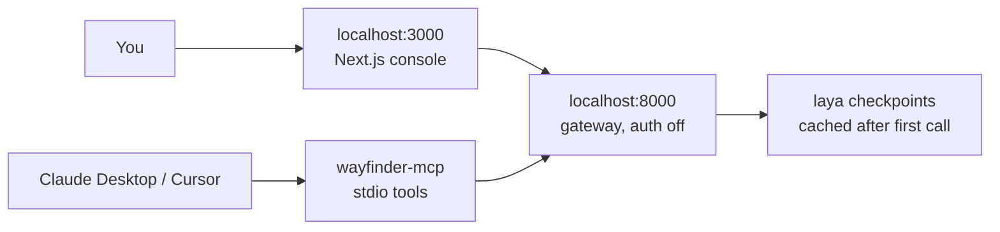

The fastest way to evaluate Wayfinder is to not deploy anything. The gateway boots keyless on your laptop, the UI talks to it directly, and the same decisions your production code will call are one curl away. When you're convinced, the MCP server puts those decisions inside Claude Desktop or Cursor.

## The architecture



Local mode is deliberately keyless: no SuperTokens core, no API keys, a dev-admin that owns everything. Inference is identical to production — same policies file, same verdict math. The only thing local lacks is the platform layer, which is exactly what you don't need while evaluating.

## Build it

```bash
python3 -m venv .venv && .venv/bin/python -m pip install -e .
WAYFINDER_PRELOAD=0 .venv/bin/python -m wayfinder.app
```

```bash
cd web && npm install && npm run dev
```

Then prove it works:

```bash
curl -s localhost:8000/v1/decide/support_inbound \
  -H 'content-type: application/json' \
  -d '{"state": {"body": "Billed twice, refund today or we cancel"}}' \
  | python -m json.tool
```

`WAYFINDER_PRELOAD=0` keeps boot instant; the first inference downloads the checkpoint and caches it. Flip to `1` when you want production-shaped warmup.

## Add MCP clients

Install the extra, then register the stdio server in Claude Desktop or Cursor:

```bash
pip install -e ".[mcp]"
```

```json
{
  "mcpServers": {
    "wayfinder": {
      "command": "wayfinder-mcp",
      "env": { "LAYA_DEVICE": "cpu" }
    }
  }
}
```

Five tools appear: decide, predict, route, policies, status. Ask the assistant to route a ticket or score a draft and watch it call the gateway instead of guessing. Checkpoint loading is lazy by default so the MCP handshake stays instant — the first decision pays the load, once.

## Pitfalls

- **Never commit `.env`.** Local overrides carry gateway URLs and OAuth creds; the gitignore already excludes them, keep it that way.
- **`WAYFINDER_TEST_AUTH=1` is for CI, never prod.** It is a backdoor with the subtlety of a screen door.
- **Auth behaves differently local vs prod.** Local dev-admin sees everything; production enforces sessions and keys. Test your 401 paths against the real thing before launch.
