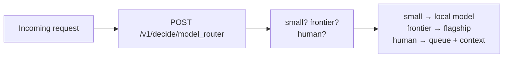

Most AI bills are upside down. A gateway sends everything — password resets, date formatting, existential contract disputes — to the same frontier model, because routing each request "correctly" would require reading it first, which costs as much as just answering it. So the three-cent question and the three-dollar question ride in the same seat.

A routing decision is one choice question: small, frontier, or human. Answer it in milliseconds for fractions of a cent, and the expensive seat stays empty except when it matters. Teams routinely cut inference spend by half or more with no quality change, because most traffic was never hard.

## The architecture



The router sits in front of your model tier like a bouncer with a guest list. "Simple, factual, low-risk, reversible" goes left; "complex, high-stakes, ambiguous, irreversible" goes right; anything legal, medical, safety-critical, or furious goes to a person.

## Build it

```bash
curl $WF_URL/v1/decide/model_router \
  -H "authorization: Bearer $WF_KEY" -H 'content-type: application/json' -d '{
  "state": {"request": "Format these 12 dates as ISO strings."}
}'
```

```python
r = decide("model_router", {"request": text})
tier = r["answers"]["route"]["choice"]
if tier == "small":
    answer = local_model(text)
elif tier == "frontier":
    answer = flagship_model(text)
else:
    queue_for_human(text, context=r)
```

Log the tier against downstream thumbs-up rates for a month. If "small" answers satisfy at the same rate as frontier did, your old bill was a donation.

## Pitfalls

- **Confidence gates the savings.** Low-confidence routes should default up a tier, not down — a frontier call is cheaper than a wrong answer.
- **Humans are a tier, not a failure.** "Needs a person" is a successful routing decision. Price it that way in your metrics.
- **Revisit quarterly.** As your small models improve, the frontier-worthy slice shrinks. Move the boundary and pocket the difference.
