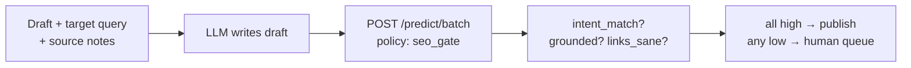

AI writing made drafts cheap and publishing scary. When a draft costs eleven cents, writers stop reading them — and that is exactly when the unsourced claim, the off-intent section, and the hallucinated internal link all ship together. The bottleneck moved from writing to verification, and most teams verify with vibes.

A pre-publish gate turns vibes into three yes/no questions with probabilities: does this match the target intent, are the claims grounded in the supplied sources, are the suggested links sane? Twenty milliseconds of judgement per draft, and the review queue finally contains only drafts that need reviewing.

## The architecture



Writing and judging stay on different models on purpose. The generator is optimized for fluent prose; the gate is optimized for calibrated yes/no answers. One model doing both is how confident nonsense ships.

## Build it

```bash
curl $WF_URL/predict/batch \
  -H "authorization: Bearer $WF_KEY" -H 'content-type: application/json' -d '{
  "states": [{"target_query": "internal linking guide",
              "draft_excerpt": "Link related pages with descriptive anchors...",
              "sources_note": "based on site crawl + help docs"}],
  "policy": "seo_gate"
}'
```

```python
rows = run("gate", drafts)  # examples/seo_bulk.py
publishable = [r for r in rows if r["verdict"] == "publish"]
```

The publish rule is strict on purpose: all three signals at 0.8 or above. A draft that is perfectly on-intent but half-invented is not "mostly fine" — it is the exact draft that burns reader trust.

## Tuning the gate

++Start strict, then loosen with evidence++ — never the reverse. Log every gate decision against what the human reviewer later found; after a few hundred drafts you will know which of the three checks is too jumpy for your niche. Thresholds are per-call overrides, so the how-to vertical can run looser than the medical one without a redeploy.

## Pitfalls

- **Grounded needs sources in the state.** The gate cannot verify claims against documents it never saw — include the source notes or the check is theater.
- **Don't gate creativity, gate facts.** Run the gate on the informative sections; let the intro breathe.
- **Watch the queue depth.** If 90% of drafts queue for review, your generator prompt is the problem, not the gate.
