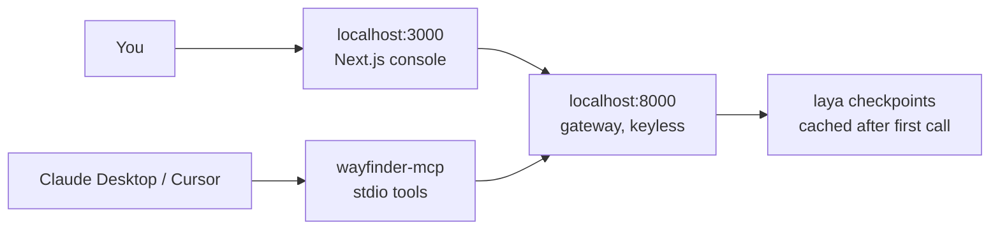

Sometimes you want the code, not the API: to read the verdict logic, to try a policy tweak, or to hack on the UI. The repo runs on your laptop with zero configuration — keyless dev mode, local SQLite, checkpoints cached after the first call. This guide goes from clone to your first decision.

## The architecture



Local mode skips accounts entirely: a dev-admin owns everything, inference is identical to hosted — same policies file, same verdict math. What you don't get locally is the hosted platform layer (managed sign-in, quotas), which is exactly what you don't need while exploring.

## Step 1: boot the gateway

```bash
git clone https://github.com/manish-9245/Wayfinder.git
cd Wayfinder
python3 -m venv .venv && .venv/bin/python -m pip install -e .
WAYFINDER_PRELOAD=0 .venv/bin/python -m wayfinder.app
```

`WAYFINDER_PRELOAD=0` keeps boot instant; the first inference downloads the checkpoint from Hugging Face and caches it. The API is now on :8000 — prove it:

```bash
curl -s localhost:8000/v1/decide/support_inbound \
  -H 'content-type: application/json' \
  -d '{"state": {"body": "Billed twice, refund today or we cancel"}}' \
  | python -m json.tool
```

## Step 2: boot the UI

```bash
cd web && npm install && npm run dev
```

Open localhost:3000/console. Pick a policy, load a hard case — multilingual tickets, jailbreak attempts, veiled threats are all preloaded — and read the verdict the same way your code would. The batch page scores up to 128 states at once.

## Step 3: try the bulk scripts

The repo ships the same patterns the blog posts describe, ready to run against your local gateway:

```bash
WAYFINDER_URL=http://127.0.0.1:8000 python examples/lead_scoring.py
WAYFINDER_URL=http://127.0.0.1:8000 python examples/seo_bulk.py internal_link
```

No key needed locally — leave `WF_KEY` unset and the scripts call the open dev gateway directly.

## Step 4 (optional): MCP clients

```bash
pip install -e ".[mcp]"
```

```json
{
  "mcpServers": {
    "wayfinder": {
      "command": "wayfinder-mcp",
      "env": { "LAYA_DEVICE": "cpu" }
    }
  }
}
```

Five tools appear in Claude Desktop or Cursor: decide, predict, route, policies, status. Ask the assistant to route a ticket and watch it call your local gateway instead of guessing. Checkpoint loading stays lazy so the handshake is instant.

## Pitfalls

- **Never commit `.env`.** Local overrides and any keys stay out of git — the gitignore already excludes them.
- **`WAYFINDER_TEST_AUTH=1` is for CI, never shared.** It is a test backdoor, not a feature.
- **Local auth differs from hosted.** Dev-admin sees everything; hosted enforces sessions and keys. Test your 401 paths against the real API before you rely on them.
