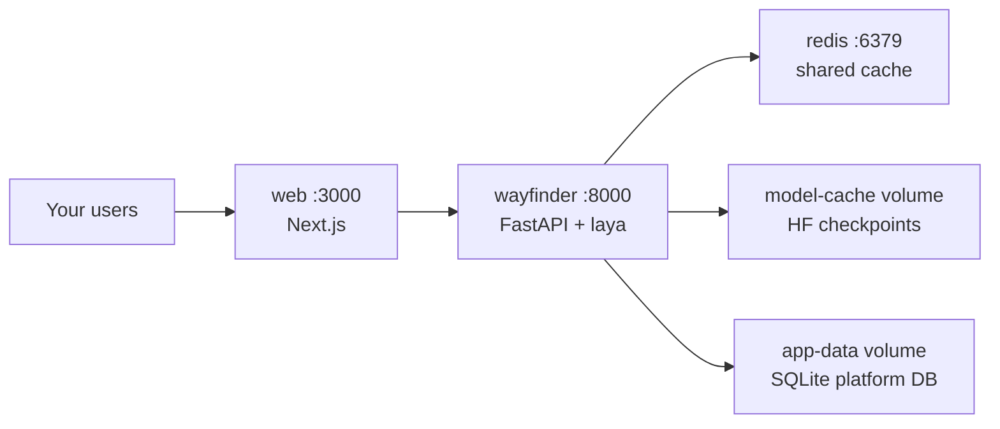

The hosted version exists for convenience, not lock-in. The entire stack — gateway, cache, frontend — is one compose file, and the model weights are Apache-2.0. If your compliance story requires data to stay on metal you own, self-hosting is a first-class path, not an afterthought.

## The architecture



Two volumes do the quiet work: `model-cache` keeps the Hugging Face checkpoints across restarts (first boot downloads, every boot after is fast), and `app-data` holds the SQLite platform database with users, keys, and logs.

## Build it

```bash
docker compose up --build
```

That is the whole deploy. The gateway serves on :8000, the UI on :3000, Redis shares cache across replicas. For a single box, SQLite is fine; when you outgrow it, uncomment the Postgres block in the compose file and point `DATABASE_URL` at it.

Env contract worth knowing:

| Variable | Meaning |
|---|---|
| `LAYA_DEVICE` | `cpu`, `cuda`, or `mps` — empty means auto |
| `LAYA_THREADS` | Cap at or below physical cores |
| `WAYFINDER_PRELOAD` | `1` warms checkpoints at boot |
| `WAYFINDER_API_KEY` | Master bearer; empty means open (dev only) |
| `WAYFINDER_REDIS_URL` | Shared cache past one replica |

Scale by adding containers, not uvicorn workers — torch inference is not fork-safe for multi-worker preload on some platforms. One worker per container, replicas behind anything.

## Production touches

Set `WAYFINDER_DOCS=0` so the interactive API explorer isn't public, `WAYFINDER_REQUIRE_AUTH=1` so anonymous callers get 401s, and wire SuperTokens core when you want managed sign-in instead of the keyless dev-admin. Monitor `/metrics`: request counts, hit rate, latency, blocks.

## Pitfalls

- **Don't oversubscribe threads.** More torch threads than physical cores is a large CPU regression, not a speedup.
- **Back up app-data.** API key hashes and usage history live there; the volume is the database.
- **First boot is slow.** The checkpoint download happens once and caches. Don't read the first-boot latency as the steady state.
