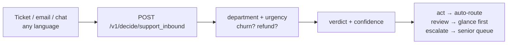

Support triage is death by a thousand papercuts. Each ticket takes a human thirty seconds to read and route — department, urgency, is this person about to churn, did they ask for a refund — and a busy queue holds hundreds. Multilingual tickets make it worse: they sit until someone who reads the language logs on.

The `support_inbound` policy answers all four questions in one forward pass, in over a hundred languages, with the checkpoint router picking English or multilingual weights per input. About 33 milliseconds a ticket. The queue triages itself as it arrives.

## The architecture



One call, answers plus a verdict. Your code branches on the verdict and never parses prose — there is no prose. That is the whole integration: if act, route automatically; otherwise a human sees it with the reason attached.

## Build it

```bash
curl $WF_URL/v1/decide/support_inbound \
  -H "authorization: Bearer $WF_KEY" -H 'content-type: application/json' -d '{
  "state": {"body": "Billed twice, refund today or we cancel"}
}'
```

```python
import httpx
r = httpx.post(f"{BASE}/v1/decide/support_inbound",
               headers={"authorization": f"Bearer {KEY}"},
               json={"state": {"body": text}}, timeout=60).json()
if r["verdict"]["verdict"] == "act":
    route_automatically(r)
else:
    escalate_to_human(r)
```

Try it without code first: the [console](/console) runs the same policy with hard cases preloaded, including Hindi and Arabic tickets.

## Thresholds that respect the stakes

Start at 0.85 auto-act, 0.60 escalate, then tune per queue. Refund and churn signals deserve asymmetric caution: a missed churn threat costs a customer, while an over-escalated routine ticket costs a glance. Measure escalation precision for a week before you let anything auto-refund.

## Pitfalls

- **Gate on confidence, not vibes.** The verdict already encodes the thresholds — branch on it, don't re-read the answers.
- **Multilingual ships uncalibrated.** Fit or at least eyeball thresholds separately for non-English traffic.
- **Keep the human loop for anger.** Urgency plus churn language should bias toward a person even when the model is confident.
