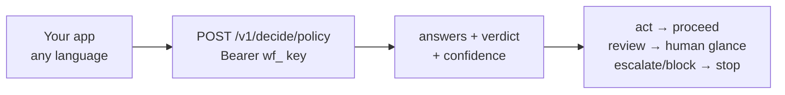

You don't need to run any infrastructure to use Wayfinder in your project. The hosted gateway is an HTTPS API: sign in, create a key, and every decision becomes one POST that returns answers plus a verdict your code can branch on. This guide takes you from zero to a working integration in three steps.

## The architecture



Your app owns the workflow; the gateway owns the judgement. There is nothing to parse — no prose, no regexes, just a typed verdict.

## Step 1: get a key

Sign in on the site, open the dashboard, and create an API key. The raw `wf_…` secret shows exactly once — copy it into your server's environment, never into client-side code or git:

```bash
export WF_URL=https://wayfinder-backend.buildwithmanish.com
export WF_KEY=wf_…
```

## Step 2: make your first decision

Route one support ticket. One call asks every question in parallel — department, urgency, churn, refund — and returns a single verdict:

```bash
curl $WF_URL/v1/decide/support_inbound \
  -H "authorization: Bearer $WF_KEY" -H 'content-type: application/json' -d '{
  "state": {"body": "Billed twice, refund today or we cancel"}
}'
```

```python
import httpx
r = httpx.post(f"{WF_URL}/v1/decide/support_inbound",
               headers={"authorization": f"Bearer {WF_KEY}"},
               json={"state": {"body": text}}, timeout=60).json()
if r["verdict"]["verdict"] == "act":
    route_automatically(r)
else:
    escalate_to_human(r)
```

```ts
const r = await fetch(`${WF_URL}/v1/decide/support_inbound`, {
  method: "POST",
  headers: { "content-type": "application/json", authorization: `Bearer ${WF_KEY}` },
  body: JSON.stringify({ state: { body: text } }),
}).then((r) => r.json());
if (r.verdict.verdict === "act") routeAutomatically(r);
else escalateToHuman(r);
```

Try it without code first: the [console](/console) runs the same policies with hard cases preloaded.

## Step 3: go bulk

Background workloads go through `/predict/batch` — up to 128 states per call, shared forward passes, each row back with its own verdict and confidence, ready for CSV or a direct database write:

```bash
curl $WF_URL/predict/batch \
  -H "authorization: Bearer $WF_KEY" -H 'content-type: application/json' -d '{
  "states": [{"body": "refund pls"}, {"body": "server down!"}],
  "policy": "support_inbound"
}'
```

```python
# Score 700 leads in ~6 calls, write score + band + confidence per row.
# See examples/lead_scoring.py in the repo for the full pattern.
```

Thresholds are optional per call — omit `options` for policy defaults, or pass `{"auto_act_above": 0.9}` to tighten a sensitive flow without touching anything else.

## All eleven policies

| Policy | Use it for |
|---|---|
| `support_inbound` | Ticket triage in any language |
| `llm_firewall` | Block jailbreaks before your model |
| `model_router` | Small vs frontier vs human per request |
| `content_safety` | Toxicity and threat scoring |
| `lead_scoring` | Need, timeline, authority, budget per lead |
| `seo_internal_link`, `seo_intent`, `seo_audit` | Bulk SEO judgements |
| `seo_prospect`, `seo_gate`, `seo_answer` | Outreach fit, draft gates, answer coverage |

`GET /policies?full=1` returns every schema for builders. Every response carries an `X-Request-ID` header — quote it in support requests.

## Pitfalls

- **Keys live server-side.** A `wf_…` key in browser JavaScript is a public credential. Proxy through your backend.
- **Handle 401s gracefully.** Invalid or revoked key → 401 with a JSON detail. Show a reconnect prompt, not a stack trace.
- **Branch on the verdict, not the answers.** The verdict already encodes the thresholds — that is the contract that stays stable as models improve.
